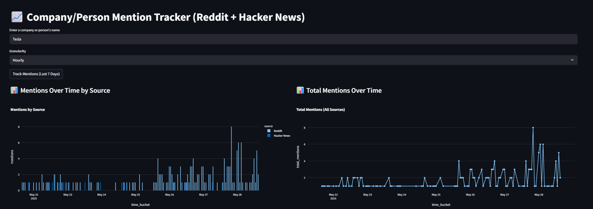
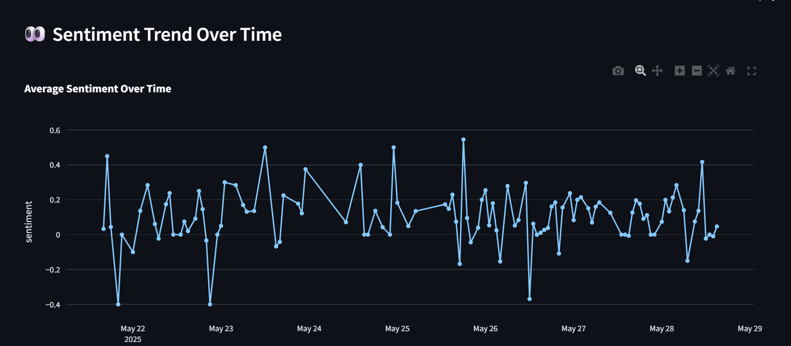
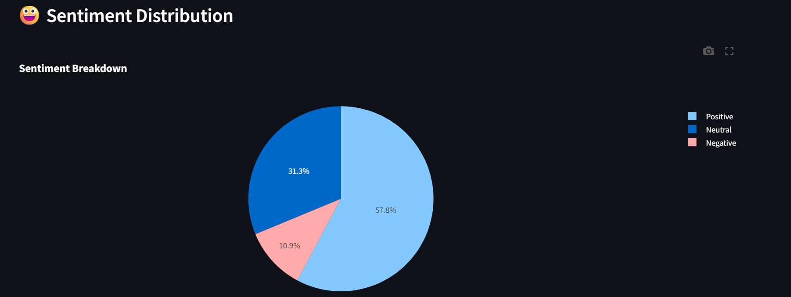
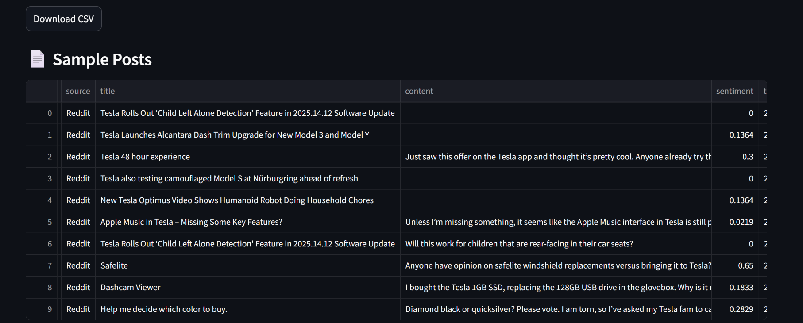

# 📈 Mention Tracker: Reddit + Hacker News

A Streamlit-powered web application that tracks how often a company or person is mentioned across **Reddit** and **Hacker News** over the last 7 days. It also provides sentiment analysis, visual trends, and keyword insights.

 <!-- Optional: Add a screenshot image -->




---

## 🚀 Features

- 🔍 **Search Mentions** of any company or individual
- ⌛ **Granularity Control**: View trends hourly or daily
- 💬 **Sentiment Analysis** using `TextBlob`
- 📊 **Interactive Charts** with Plotly:
  - Mentions over time (by source & total)
  - Average sentiment trend
  - Sentiment distribution (Pie chart)
- ☁️ **Word Cloud** of top keywords
- 📁 **Export Data** as CSV
- 📰 **Sample Posts** table to inspect top results

---

## 🛠️ Tech Stack

- [Streamlit](https://streamlit.io/)
- [PRAW (Python Reddit API Wrapper)](https://praw.readthedocs.io/)
- [HN Algolia API](https://hn.algolia.com/api)
- [TextBlob](https://textblob.readthedocs.io/)
- [Plotly](https://plotly.com/python/)
- [WordCloud](https://github.com/amueller/word_cloud)
- [Matplotlib](https://matplotlib.org/)
- [Python-dotenv](https://pypi.org/project/python-dotenv/)

---

## 📦 Installation

1. **Clone the repo**:
   ```bash
   git clone https://github.com/yourusername/mention-tracker.git
   cd mention-tracker
    ```

2. **Create and activate a virtual environment**:

   ```bash
   python -m venv venv
   source venv/bin/activate   # On Windows: venv\Scripts\activate
   ```

3. **Install dependencies**:

   ```bash
   pip install -r requirements.txt
   ```

4. **Set up environment variables**:

   Create a `.env` file in the root directory and add your Reddit API credentials:

   ```env
   REDDIT_CLIENT_ID=your_client_id
   REDDIT_CLIENT_SECRET=your_client_secret
   REDDIT_USERNAME=your_username
   REDDIT_PASSWORD=your_password
   ```

---

## ▶️ Usage

Run the Streamlit app:

```bash
streamlit run app.py
```

Enter a search term (company or person), choose granularity (Hourly/Daily), and click **Track Mentions**.

---

## 📤 Output

* CSV export of collected data
* Time series charts and sentiment trends
* Word cloud visualization
* Pie chart for sentiment breakdown

---

## 🤖 Example Use Cases

* Track tech brand popularity on Reddit & HN
* Monitor public sentiment for startups or influencers
* Research trends for market intelligence or academic studies

---

## 📸 Screenshots

<!-- Include screenshots if available -->

* 📊 Mentions Over Time
* 📈 Sentiment Trend
* ☁️ Keyword Word Cloud
* 📄 Sample Posts Table

---

## ⚖️ License

This project is open-source and available under the [MIT License](LICENSE).

---

## 🙌 Credits

* Reddit data via [PRAW](https://praw.readthedocs.io/)
* Hacker News data via [HN Algolia API](https://hn.algolia.com/api)
* Sentiment analysis powered by [TextBlob](https://textblob.readthedocs.io/)

---

## ⭐️ Give it a star!

If you find this project helpful, please ⭐️ the repository and share it!

```

Let me know if you'd like me to generate a `requirements.txt` or add GitHub Actions for deployment!
```
